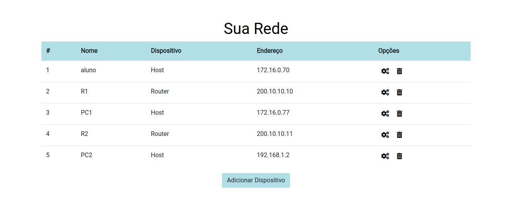
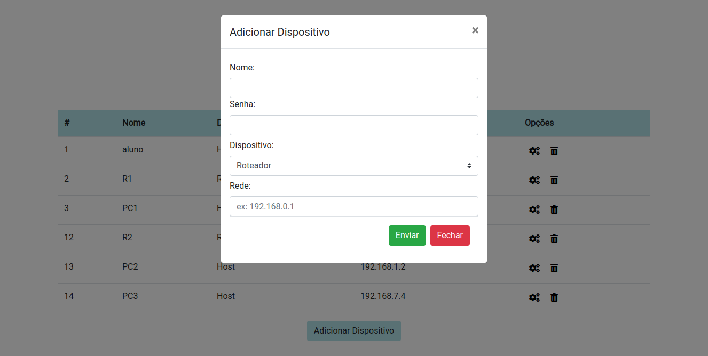
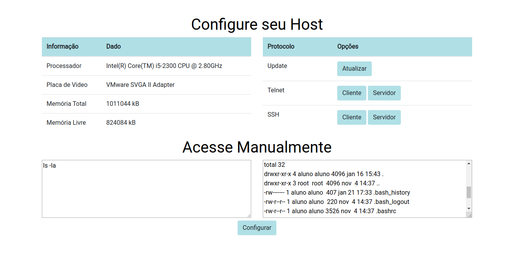
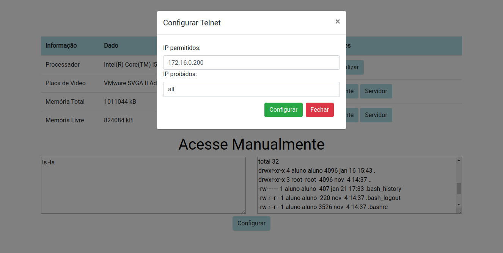

# Configuracao automática de protocolos

**Descrição:**

Esta aplicação tem como objetivo a configuração automática dos servidores mais usuais em máquinas linux e dos protocolos de roteamento nos dispositivos de rede em sua rede local.

**Ambiente:**

Inicialmente os testes serão realizados em VMs integradas ao VirtualBox, este sendo adequado para simular hosts e roteadores comuns em redes internas.

**Funcionalidades**

  1. Configurar automáticamente a rede com os servidores e protocolos disponíveis
  
  2. Monitoramento da rede local e dos dispositivos conectados

**Visual**

A primeira página tem as seguintes caracteristicas:

Nesta página são mostrados os dispositivos que foram adicionados ao banco de dados representando as máquinas conectadas a rede.

Mais máquinas podem ser adicionadas através do botão abaixo da tabela, abrindo locais para o preenchimento dos dados do dispositivo:

Também podem ser deletadas na lixeira ao lado de cada uma, e configurada na engrenagem que abre a seguinte página de acordo com o tipo de máquina selecionado.

Nesta página são mostrados os dados da máquina no lado esquerdo, e no lado direito as configurações pré-prontas, abaixo um campo para mandar comandos diretamente e ao lado a saida dos comandos digitados.

Configurações mais complicadas vão requerer informações do usuario, tais como a configuração do servidor telnet:

Aqui você pode definir qual ip será permitido e qual será proibido.

Após clicar em configurar, a configuração será executada e um alerta será exibido na tela mostrando a saída dos comandos (o mesmo para todas as outras configurações).

**Requesitos**

Você precisará permitir o acesso aos dispositivos que deseja configurar, pois os mesmos serão acessados via SSH.
